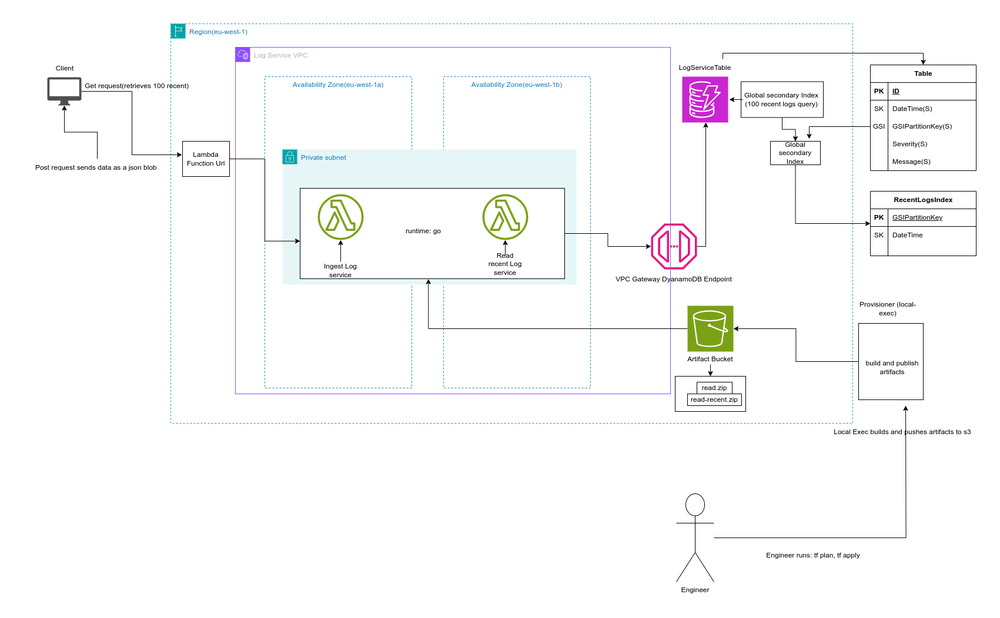

# Simple Log Service

A scalable, secure log ingestion and retrieval service built on AWS serverless infrastructure.

## Table of Contents

- [Overview](#overview)
- [Architecture](#architecture)
- [Database Design](#database-design)
- [Technology Choices](#technology-choices)
- [Prerequisites](#prerequisites)
- [Project Structure](#project-structure)
- [Setup and Deployment](#setup-and-deployment)
- [API Usage](#api-usage)
- [Testing](#testing)
- [Cleanup](#cleanup)
- [Design Decisions](#design-decisions)

---

## Overview

This project implements a simple yet production-ready log service that:
- Ingests log entries via HTTP POST requests
- Retrieves the 100 most recent log entries
- Runs entirely on AWS serverless infrastructure
- Is fully Infrastructure as Code (IaC) driven using Terraform
- Implements security best practices with IAM least privileges and VPC isolation

**Key Features:**
- ✅ Serverless architecture (AWS Lambda + DynamoDB)
- ✅ Sub-second response times with Go runtime
- ✅ Secure private networking with VPC Gateway Endpoints
- ✅ Efficient querying with DynamoDB Global Secondary Index
- ✅ Fully automated deployment via Terraform

---

## Architecture



### Components

1. **Lambda Functions (Go 1.x Runtime)**
   - **Ingest Lambda**: Accepts and validates log entries, stores them in DynamoDB
   - **Read Recent Lambda**: Retrieves the 100 most recent log entries using GSI

2. **Database (Amazon DynamoDB)**
   - Single table design with Global Secondary Index for efficient queries
   - On-demand billing for cost optimization
   - Point-in-time recovery enabled for data durability

3. **Networking**
   - VPC with private subnets across 2 Availability Zones (eu-west-1a, eu-west-1b)
   - VPC Gateway Endpoint for DynamoDB (no internet access required)
   - Lambda Function URLs for public HTTP access

4. **Build Pipeline**
   - Local provisioner builds Go binaries
   - Artifacts stored in S3 for versioning and deployment

### Request Flow

**Ingest Flow:**
```
Client → Lambda Function URL → Ingest Lambda (Private Subnet) → VPC Gateway Endpoint → DynamoDB
```

**Read Flow:**
```
Client → Lambda Function URL → Read Recent Lambda (Private Subnet) → VPC Gateway Endpoint → DynamoDB
```

---

## Database Design

### Table: LogServiceTable

**Primary Key Structure:**
```
Partition Key: ID (String)       - UUID v4
Sort Key: DateTime (String)      - ISO 8601 timestamp (RFC3339)
```

**Attributes:**
| Attribute | Type | Description | Example |
|-----------|------|-------------|---------|
| ID | String | Unique identifier (UUID v4) | `"550e8400-e29b-41d4-a716-446655440000"` |
| DateTime | String | ISO 8601 timestamp | `"2026-02-03T14:30:00Z"` |
| Severity | String | Log level: info, warning, error | `"error"` |
| Message | String | Log message text | `"Database connection timeout"` |
| GSIPartitionKey | String | Fixed value for GSI queries | `"ALL_LOGS"` |

### Global Secondary Index: RecentLogsIndex

**Purpose:** Enable efficient retrieval of the 100 most recent logs across all severity levels.

**Key Structure:**
```
Partition Key: GSIPartitionKey (String)  - Fixed value "ALL_LOGS"
Sort Key: DateTime (String)              - ISO 8601 timestamp
```

**Query Strategy:**
- All log entries share the same `GSIPartitionKey` value
- Querying the GSI with `ScanIndexForward=false` returns logs in descending order (newest first)
- `Limit=100` ensures only the most recent 100 entries are returned
- Single-partition design trades write distribution for read efficiency (acceptable for this use case)

**Index Projections:** ALL (all attributes projected to avoid additional reads)

### Schema Design Rationale

**Why This Design:**

1. **Efficient Recent Queries**: The GSI with DateTime as sort key allows O(1) partition access + O(log n) sort, retrieving 100 items in ~10-50ms
2. **Simplicity**: Single GSI covers the primary read pattern without complex query logic
3. **Scalability**: DynamoDB handles millions of writes/reads per second; the fixed partition key is acceptable given the 100-item limit
4. **Cost Optimization**: On-demand billing means you only pay for actual usage

**Trade-offs:**

| Aspect | Trade-off | Justification |
|--------|-----------|---------------|
| Write Distribution | All writes go to same GSI partition | Acceptable: DynamoDB can handle 1000+ WCU per partition; log ingestion rarely exceeds this |
| Storage | Duplicating DateTime in GSI | Negligible: DateTime is small (~25 bytes); storage is cheap compared to query performance |

### Example Data

```json
{
  "ID": "550e8400-e29b-41d4-a716-446655440000",
  "DateTime": "2026-02-03T14:30:00Z",
  "Severity": "error",
  "Message": "Failed to process payment transaction",
  "GSIPartitionKey": "ALL_LOGS"
}
```

---

## Technology Choices

### 1. Database: Amazon DynamoDB

**Why DynamoDB?**

- ✅ **Serverless & Fully Managed**: No server provisioning, patching, or maintenance
- ✅ **Predictable Performance**: Single-digit millisecond latency at any scale
- ✅ **Cost-Effective**: On-demand billing aligns with variable log ingestion patterns
- ✅ **Built-in HA**: Multi-AZ replication with 99.99% availability SLA
- ✅ **Flexible Indexing**: GSI enables efficient time-based queries without table scans

**Comparison with Alternatives:**

| Feature | DynamoDB | Aurora Serverless | RDS |
|---------|----------|-------------------|-----|
| Cold Start | None | 10-30s | N/A (always running) |
| Scaling | Automatic, instant | Automatic, 15-30s | Manual |
| Cost (low traffic) | $0.25/GB/month + requests | Minimum $0.06/ACU-hour | $15+/month minimum |
| Operational Overhead | Minimal | Low | High (patching, backups) |
| Time-series Queries | Excellent (GSI) | Excellent (indexes) | Excellent (indexes) |

**Decision:** DynamoDB is optimal for this use case due to true serverless characteristics, no cold starts, and pay-per-request pricing that matches sporadic log ingestion patterns.

### 2. Runtime: Go (Golang)

**Why Go for Lambda?**

- ✅ **Fast Cold Starts**: ~100-200ms vs ~1-3s for Python/Node.js
- ✅ **Memory Efficient**: Smaller footprint = lower costs (Lambda charges by GB-seconds)
- ✅ **High Performance**: Native compilation provides excellent throughput for log ingestion
- ✅ **Type Safety**: Compile-time checks reduce runtime errors in production
- ✅ **Concurrency**: Built-in goroutines enable efficient parallel processing (future-proofing)
- ✅ **AWS SDK**: Well-maintained SDK v2 with excellent DynamoDB integration

**Performance Comparison (Cold Start + Execution):**

| Runtime | Avg Cold Start | 128MB Memory | Use Case Fit |
|---------|----------------|--------------|--------------|
| Go 1.x | 100-200ms | Excellent | ⭐⭐⭐⭐⭐ Best for this service |
| Python 3.x | 200-500ms | Good | ⭐⭐⭐ More verbose, slower |
| Node.js | 300-600ms | Good | ⭐⭐⭐ Async benefits not needed here |
| Java | 2-5s | Poor (requires 512MB+) | ⭐ Not suitable for simple APIs |


### 3. Architecture: ARM64 (Graviton2) vs x86_64Why ARM64?
  - ✅ 20% Cost Savings: ARM64 (Graviton2) Lambda functions cost 20% less than x86_64
  - ✅ Better Performance: Up to 19% better price-performance ratio for compute-intensive workloads
  - ✅ Energy Efficient: Lower power consumption, aligning with sustainability goals
  - ✅ Go Compatibility: Go has excellent ARM64 support with native compilation
  - ✅ No Code Changes: Go cross-compiles seamlessly to ARM64 architecture

**Performance Benefits:**
    - Go runtime optimized for ARM64
    - Faster execution for JSON parsing and DynamoDB SDK calls
    - Lower latency for high-throughput log ingestion

**Why This Matters for Log Service:**
    - High request volume amplifies cost savings
    - Every millisecond counts in log ingestion latency
    - Forward-compatible with AWS Graviton3 (even better performance)

**Trade-offs:**
    - Requires ARM64-compatible dependencies (not an issue for Go stdlib and AWS SDK)
    - Slightly different debugging (mitigated by comprehensive logging)

 Decision: ARM64 is optimal

### 3. Networking: Private Subnets + VPC Gateway Endpoint

**Why Private Networking?**

- ✅ **Security**: Defense in depth - Lambdas have no internet access, reducing attack surface
- ✅ **Cost Savings**: VPC Gateway Endpoint is **free** (vs $32+/month for NAT Gateway)
- ✅ **Performance**: Traffic stays on AWS backbone network, ~5-10ms lower latency
- ✅ **Compliance**: Data never leaves AWS network, simplifying audits
- ✅ **Scalability**: Gateway endpoints auto-scale without quotas

**Architecture Benefits:**
- Traffic flow: `Lambda → VPC Gateway Endpoint → DynamoDB` (no internet involved)
- Even if Lambda code is compromised, no data exfiltration possible
- Meets enterprise security requirements for production workloads

---

## Prerequisites

Before deploying this service, ensure you have:

### Required Tools

- **AWS CLI** (v2.x): [Installation Guide](https://docs.aws.amazon.com/cli/latest/userguide/install-cliv2.html)
- **Terraform** (v1.5+): [Download](https://www.terraform.io/downloads)
- **Go** (v1.21+): [Installation](https://golang.org/doc/install)
- **Make**: Pre-installed on Linux/macOS, [Windows instructions](https://gnuwin32.sourceforge.net/packages/make.htm)
- **Git**: For cloning the repository

### AWS Configuration

1. **AWS Account** with appropriate permissions (see IAM requirements below)
2. **AWS CLI configured** with credentials:
   ```bash
   aws configure
   # Enter your Access Key ID, Secret Key, and default region (e.g., eu-west-1)
   ```
---

## Project Structure

```
log-service/
├── cmd/
│   ├── ingest/
│   │   └── main.go              # Ingest Lambda handler
│   ├── read-recent/
│   │   └── main.go              # Read Recent Lambda handler
│   └── artifacts/               # Compiled binaries (generated)
│       ├── ingest.zip
│       └── read-recent.zip
├── internal/
│   └── models/
│       └── log_entry.go         # Shared data models
├── terraform/
│   ├── main.tf                  # Main infrastructure config
│   ├── variables.tf             # Input variables
│   ├── outputs.tf               # Output values (Lambda URLs)
│   ├── dynamodb.tf              # DynamoDB table & GSI
│   ├── lambda.tf                # Lambda functions & roles
│   ├── networking.tf            # VPC, subnets, endpoints
│   ├── s3.tf                    # Artifact storage
│   └── build.tf                 # Provisioners for Go builds
├── docs/
│   └── LogService.drawio        # Architecture diagram
│   └── architecture.png         # Architecture diagram
├── Makefile                     # Build automation
├── go.mod                       # Go dependencies
├── go.sum                       # Dependency checksums
└── README.md                    # This file
```

---

## Setup and Deployment

### Step 1: Clone the Repository

```bash
git clone https://github.com/King-Zingelwayo/log-service.git
cd log-service
```

### Step 2: Initialize Terraform

```bash
cd terraform
terraform init
```

**Expected Output:**
```
Initializing the backend...
Initializing provider plugins...
- Finding latest version of hashicorp/aws...
- Installing hashicorp/aws v5.x.x...
Terraform has been successfully initialized!
```

### Step 3: Review the Deployment Plan

```bash
terraform plan
```

This shows all resources that will be created. Review carefully.

### Step 4: Deploy the Infrastructure

```bash
terraform apply
```

Type `yes` when prompted. Deployment takes ~3-5 minutes.

**What Happens During Deployment:**

1. ✅ Creates VPC with private subnets across 2 AZs
2. ✅ Creates VPC Gateway Endpoint for DynamoDB
3. ✅ Creates S3 bucket for Lambda artifacts
4. ✅ Compiles Go binaries and uploads to S3
5. ✅ Creates DynamoDB table with GSI
6. ✅ Creates Lambda functions with execution roles
7. ✅ Creates Lambda Function URLs (public endpoints)

**Expected Output:**
```
Apply complete! Resources: 25 added, 0 changed, 0 destroyed.

Outputs:

ingest_lambda_url = "https://abc123.lambda-url.eu-west-1.on.aws/"
read_recent_lambda_url = "https://xyz789.lambda-url.eu-west-1.on.aws/"
```

**Save these URLs** - you'll need them for testing!

### Step 6: Verify Deployment

```bash
# Test Ingest Lambda
curl -X POST https://abc123.lambda-url.eu-west-1.on.aws/ \
  -H "Content-Type: application/json" \
  -d '{"severity": "info", "message": "Test log entry"}'

# Expected: HTTP 201 with "Log ingested"

# Test Read Recent Lambda
curl https://xyz789.lambda-url.eu-west-1.on.aws/

# Expected: HTTP 200 with JSON array of logs
```

---

## API Usage

### Ingest Lambda - POST Log Entry

**Endpoint:** `POST <ingest_lambda_url>`

**Request Headers:**
```
Content-Type: application/json
```

**Request Body:**
```json
{
  "severity": "error",
  "message": "Database connection timeout after 30s"
}
```

**Field Validation:**
- `severity` (required): Must be one of `"info"`, `"warning"`, or `"error"` (case-insensitive)
- `message` (required): Any non-empty string

**Response:**

**Success (201 Created):**
```
Log ingested
```

**Error Responses:**

| Status | Body | Cause |
|--------|------|-------|
| 400 | `Request body is required` | Empty request body |
| 400 | `Invalid JSON format` | Malformed JSON |
| 400 | `Both 'severity' and 'message' are required` | Missing required fields |
| 400 | `Severity must be info, warning, or error` | Invalid severity value |
| 500 | Error details | DynamoDB write failure |

**Example Requests:**

```bash
# Info log
curl -X POST https://your-ingest-url.lambda-url.eu-west-1.on.aws/ \
  -H "Content-Type: application/json" \
  -d '{"severity": "info", "message": "User logged in successfully"}'

# Warning log
curl -X POST https://your-ingest-url.lambda-url.eu-west-1.on.aws/ \
  -H "Content-Type: application/json" \
  -d '{"severity": "warning", "message": "API rate limit approaching threshold"}'

# Error log
curl -X POST https://your-ingest-url.lambda-url.eu-west-1.on.aws/ \
  -H "Content-Type: application/json" \
  -d '{"severity": "error", "message": "Payment processing failed for order #12345"}'
```

---

### Read Recent Lambda - GET 100 Most Recent Logs

**Endpoint:** `GET <read_recent_lambda_url>`

**Request:** No parameters required

**Response:**

**Success (200 OK):**
```json
[
  {
    "id": "a1b2c3d4-e5f6-7890-abcd-ef1234567890",
    "date_time": "2026-02-03T14:35:22Z",
    "severity": "error",
    "message": "Payment processing failed for order #12345"
  },
  {
    "id": "b2c3d4e5-f6a7-8901-bcde-f12345678901",
    "date_time": "2026-02-03T14:34:15Z",
    "severity": "warning",
    "message": "API rate limit approaching threshold"
  },
  {
    "id": "c3d4e5f6-a7b8-9012-cdef-123456789012",
    "date_time": "2026-02-03T14:30:00Z",
    "severity": "info",
    "message": "User logged in successfully"
  }
]
```

**Field Descriptions:**
- `id`: UUID v4 unique identifier
- `date_time`: ISO 8601 timestamp (UTC)
- `severity`: Log level (info, warning, error)
- `message`: Log message text

**Notes:**
- Results are sorted by `date_time` in **descending order** (newest first)
- Maximum 100 entries returned
- Empty array `[]` if no logs exist

**Example Request:**

```bash
curl https://your-read-recent-url.lambda-url.eu-west-1.on.aws/
```

---

## Cleanup

To avoid ongoing AWS charges, destroy all resources:

### Step 1: Remove Terraform Resources

```bash
cd terraform
terraform destroy
```

Type `yes` when prompted. This will delete:
- Lambda functions
- DynamoDB table
- VPC and networking components
- S3 bucket (if empty)
- IAM roles and policies

**Note:** If the S3 bucket contains objects, empty it first:
```bash
aws s3 rm s3://your-artifact-bucket-name --recursive
terraform destroy
```

---

## Design Decisions

### 1. Single Table Design vs. Multi-Table

**Decision:** Single DynamoDB table with GSI

**Rationale:**
- Simpler to manage and query
- Lower cost (one table = one set of on-demand charges)
- GSI provides the necessary index without complexity

**Alternative Considered:** Separate tables per severity
- **Rejected:** Requires querying 3 tables and merging results, higher latency and cost

### 2. GSI Partition Key Strategy

**Decision:** Fixed partition key value (`"ALL_LOGS"`)

**Rationale:**
- Read pattern is "all recent logs" regardless of severity
- Single partition allows efficient sorted queries
- Write throughput (1000+ WCU/partition) exceeds expected log ingestion rate

**Alternative Considered:** Partition by severity
- **Rejected:** Requires querying 3 GSI partitions and merging, defeats DynamoDB's strengths

### 3. Timestamp Format

**Decision:** ISO 8601 (RFC3339) string format

**Rationale:**
- Human-readable in DynamoDB console
- Lexicographically sortable (works with DynamoDB's string sort)
- Widely compatible with logging tools

**Alternative Considered:** Unix epoch (number)
- **Rejected:** Less readable, provides no performance benefit for this use case

### 4. Lambda Function URLs vs. API Gateway

**Decision:** Lambda Function URLs

**Rationale:**
- Simpler: No additional AWS service to configure
- Lower cost: No API Gateway charges ($3.50 per million requests)
- Sufficient for this use case (no need for throttling, custom domains, or request transformation)

**Alternative Considered:** API Gateway REST API
- **Rejected:** Adds complexity and cost without meaningful benefit

### 5. Go vs. Python/Node.js

**Decision:** Go runtime

**Rationale:**
- 2-5x faster cold starts (100ms vs 300-500ms)
- Lower memory footprint (128MB sufficient vs 256MB+ for Python/Node)
- Type safety reduces runtime errors

**Alternative Considered:** Python (AWS SDK familiarity)
- **Rejected:** Slower performance, higher costs at scale

### 6. On-Demand vs. Provisioned Capacity

**Decision:** DynamoDB On-Demand billing

**Rationale:**
- Log ingestion is unpredictable and bursty
- No need to manage capacity planning
- Cost-effective for variable workloads

**Alternative Considered:** Provisioned capacity with auto-scaling
- **Rejected:** Added complexity, risk of throttling during unexpected spikes

### 7. VPC Deployment vs. Public Lambda

**Decision:** Private subnets with VPC Gateway Endpoint

**Rationale:**
- Enhanced security (no internet access)
- Free data transfer (vs $32+/month for NAT)
- Compliance-ready architecture

**Alternative Considered:** Public Lambda (no VPC)
- **Rejected:** Security concerns, higher costs for production use

### 8. Build Automation

**Decision:** Terraform `null_resource` with local-exec + Makefile

**Rationale:**
- Simple, repeatable builds
- Triggers rebuild on source code changes
- Works with existing CI/CD tools

**Alternative Considered:** AWS SAM / AWS CDK
- **Rejected:** Team familiarity with Terraform, avoiding vendor lock-in


### 9. Binary Optimization
Decision: Stripped binaries with -ldflags="-s -w" and -trimpath
Rationale:
- 50% size reduction (8MB → 4MB)
- Faster cold starts (~10ms improvement per MB saved)
- Lower S3 storage costs
- Security benefit (no file path leakage)


---

## Author

**Sihle Ndlovu**  
Cloud Engineer(AWS)
---
**Happy Logging!**